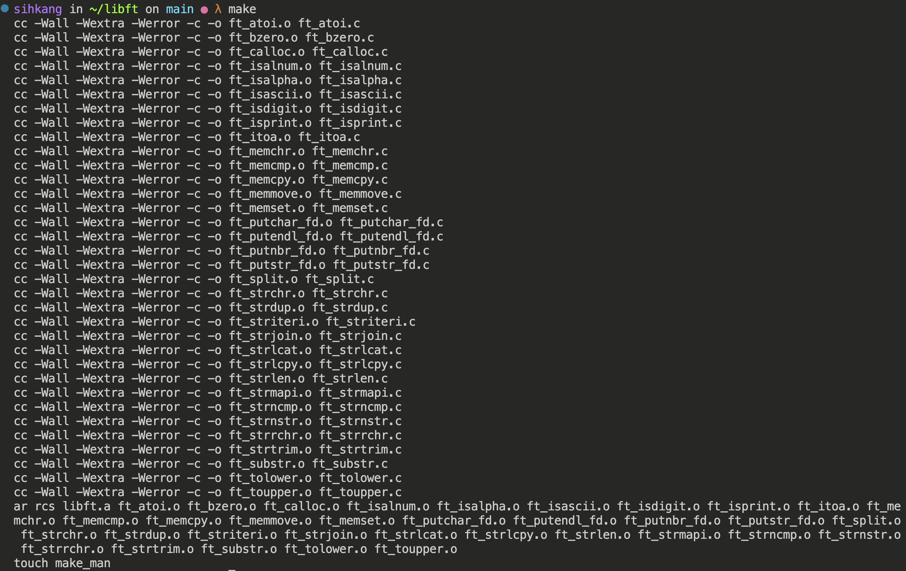
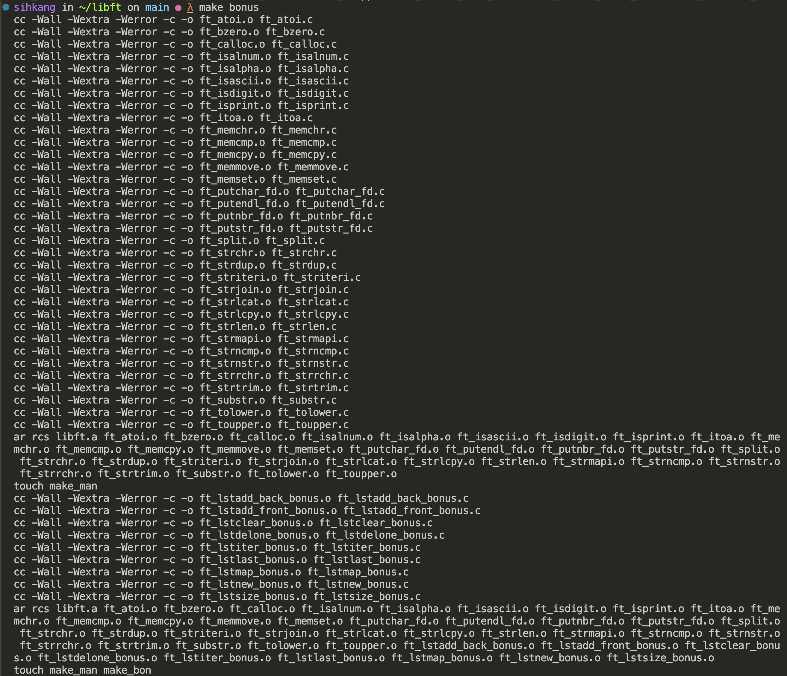
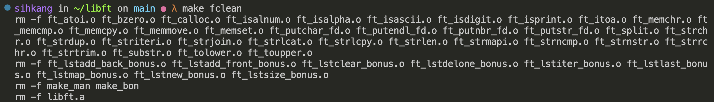

# 42_libft
42과정의 첫 프로젝트.

---
## 프로젝트 소개
- 42과정  C project 내에서 사용될 함수들을 제작하여 정적 라이브러리 파일로 만들기.
- Makefile를 사용하여 만든 C파일들을 오브젝트 파일로 컴파일 후, `libft.a` 로 만들기.(`ar` 커맨드 활용)
- `-std=c99` flag를 활용하여 컴파일 진행하도록 한다.

---

## 구현대상 
### Makefile
- `flag`: -Wall -Wextra -Werror.
- 사용 컴파일러 `cc`
- Mandatory, Bonus, clean, fclean, re 동작 구현
- 리링크 방지 : 임시파일을 활용해 타임스탬프를 기록하여 최신 상태일 시 리링크 방지

### Mandatory - 기본 함수 (C Library)
• isalpha
• isdigit
• isalnum
• isascii
• isprint
• strlen
• memset
• bzero
• memcpy
• memmove
• strlcpy
• strlcat
• toupper
• tolower
• strchr
• strrchr
• strncmp
• memchr
• memcmp
• strnstr
• atoi

In order to implement the two following functions, you will use malloc():
• calloc
• strdup

### Mandatory - C Library 외 함수
- ft_substr
- ft_strjoin
- ft_strtrim
- ft_split
- ft_itoa
- ft_strmapi
- ft_striteri
- ft_putchar_fd
- ft_putstr_fd
- ft_putendl_fd
- ft_putnbr_fd

### 보너스 함수
보너스 함수에서는 리스트 자료구조를 활용한 함수들을 제작해보도록 한다.
- ft_lstnew
- ft_lstadd_front
- ft_lstsize
- ft_lstlast
- ft_lstadd_back
- ft_lstdelone
- ft_lstclear
- ft_lstiter
- ft_lstmap

---
## Make 동작
### `make`
make mandatory part library.

### `make bonus`
make bonus with mandatory part.

### `make fclean`
clear the files except C files.

